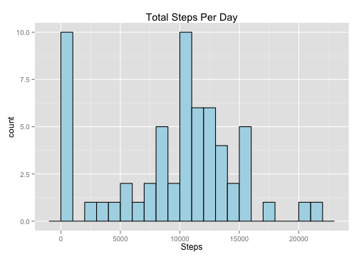
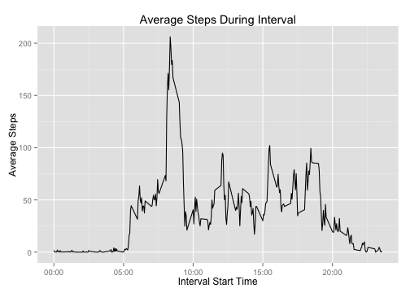
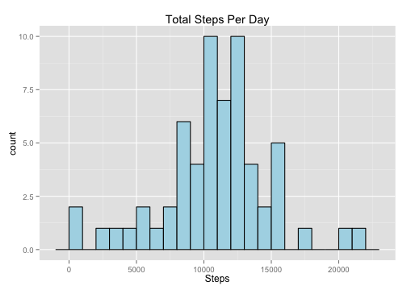
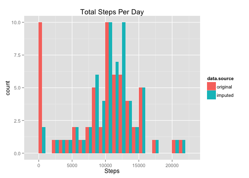
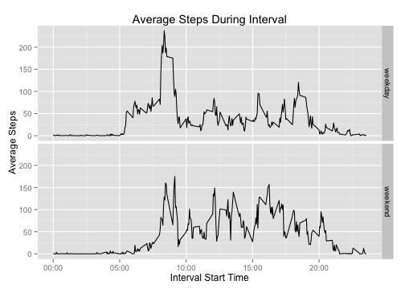

# Reproducible Research: Peer Assessment 1
## Introduction
This project examines data, collected over five-minute intervals throughout the day, about personal movement.

## Loading and preprocessing the data
We begin by loading the data exists from a zipfile called 'activity.zip' located in the current working directory.  We then preprocess it by converting dates in string form to Date objects.  We also add a column containing the day of the week for each date as well.

```r
data <- read.csv(unz("activity.zip", "activity.csv"), stringsAsFactors = F)
data <- transform(data, date = as.Date(date))
# add column for day-of-week
data$dow <- weekdays(data$date)
```


## What is mean total number of steps taken per day?
First, let's look at a histogram of the number of steps taken each day.

```r
library(ggplot2)
library(plyr)
totalStepsPerDay <- ddply(data, .(date), summarise, steps = sum(steps, na.rm = T))
ggplot(totalStepsPerDay, aes(x = steps)) + geom_histogram(binwidth = 1000, fill = "lightblue", 
    color = "black") + xlab("Steps") + ggtitle("Total Steps Per Day")
```

 


The mean and median are found using...

```r
meanStepsPerDay = mean(totalStepsPerDay$steps, na.rm = T)
medianStepsPerDay = median(totalStepsPerDay$steps, na.rm = T)
```

resulting in a mean of 9354.23 and median of 
10395 total steps per day.

## What is the average daily activity pattern?
The figure below shows the average number of steps taken during each five-minute interval (averaged across all days).

```r
timeFormatter <- function(interval) {
    sprintf("%02d:%02d", as.integer(interval/100), interval%%100)
}
meanStepsByIntervalDF <- ddply(data, .(interval), summarise, meanSteps = mean(steps, 
    na.rm = T))
maxStepInterval <- with(meanStepsByIntervalDF, interval[which.max(meanSteps)])
ggplot(meanStepsByIntervalDF, aes(x = interval, y = meanSteps)) + geom_line() + 
    ylab("Average Steps") + xlab("Interval Start Time") + ggtitle("Average Steps During Interval") + 
    scale_x_continuous(labels = timeFormatter)
```

 

The 5-minute interval with the maximum number of steps (averaged across all days) is interval 835.

## Imputing missing values

```r
numMissingRows <- nrow(data) - sum(complete.cases(data))
```

The data set contains 2304 rows (out of 
17568) in which at least one value is missing (NA). To determine an 
appropriate strategy by which to impute the missing data, I examined the pattern 
of the missing data and concluded that it was data for complete days (i.e. every 
interval within a single day) that was missing.

```r
# Each effected date is missing ALL values for that date, other dates
# missing NO data
ddply(data, .(date), summarise, is.na = sum(is.na(steps)), not.is.na = sum(!is.na(steps)))
```

```
##          date is.na not.is.na
## 1  2012-10-01   288         0
## 2  2012-10-02     0       288
## 3  2012-10-03     0       288
## 4  2012-10-04     0       288
## 5  2012-10-05     0       288
## 6  2012-10-06     0       288
## 7  2012-10-07     0       288
## 8  2012-10-08   288         0
## 9  2012-10-09     0       288
## 10 2012-10-10     0       288
## 11 2012-10-11     0       288
## 12 2012-10-12     0       288
## 13 2012-10-13     0       288
## 14 2012-10-14     0       288
## 15 2012-10-15     0       288
## 16 2012-10-16     0       288
## 17 2012-10-17     0       288
## 18 2012-10-18     0       288
## 19 2012-10-19     0       288
## 20 2012-10-20     0       288
## 21 2012-10-21     0       288
## 22 2012-10-22     0       288
## 23 2012-10-23     0       288
## 24 2012-10-24     0       288
## 25 2012-10-25     0       288
## 26 2012-10-26     0       288
## 27 2012-10-27     0       288
## 28 2012-10-28     0       288
## 29 2012-10-29     0       288
## 30 2012-10-30     0       288
## 31 2012-10-31     0       288
## 32 2012-11-01   288         0
## 33 2012-11-02     0       288
## 34 2012-11-03     0       288
## 35 2012-11-04   288         0
## 36 2012-11-05     0       288
## 37 2012-11-06     0       288
## 38 2012-11-07     0       288
## 39 2012-11-08     0       288
## 40 2012-11-09   288         0
## 41 2012-11-10   288         0
## 42 2012-11-11     0       288
## 43 2012-11-12     0       288
## 44 2012-11-13     0       288
## 45 2012-11-14   288         0
## 46 2012-11-15     0       288
## 47 2012-11-16     0       288
## 48 2012-11-17     0       288
## 49 2012-11-18     0       288
## 50 2012-11-19     0       288
## 51 2012-11-20     0       288
## 52 2012-11-21     0       288
## 53 2012-11-22     0       288
## 54 2012-11-23     0       288
## 55 2012-11-24     0       288
## 56 2012-11-25     0       288
## 57 2012-11-26     0       288
## 58 2012-11-27     0       288
## 59 2012-11-28     0       288
## 60 2012-11-29     0       288
## 61 2012-11-30   288         0
```


As a strategy to impute missing values, a new data set is created in which the missing
values are replaced by the average value for the corresponding intervals for the same
day of the week, e.g. Monday's missing data will be replaced by the mean for each
interval across all Mondays,  Tuesday's by the means across all Tuesday data, and so on.

```r
# create new data.frame with mean steps per day-of-week and interval
missingDates <- unique(data[is.na(data$steps), "date"])
imputedvals <- ddply(data, .(dow, interval), summarise, steps = mean(steps, 
    na.rm = T))
data2 <- data[complete.cases(data), ]
for (i in seq_along(missingDates)) {
    d <- missingDates[i]
    # create new df for date d's day-of-week using imputed data df
    tmp <- imputedvals[imputedvals$dow == weekdays(d), ]
    # construct data frame matching layout of data2
    df <- data.frame(steps = tmp$steps, date = rep(d, nrow(tmp)), interval = tmp$interval, 
        dow = tmp$dow)
    # append imputed data to data2
    data2 <- rbind(data2, df)
}
```


Using the new data frame containing the imputed data, the following histogram is created:

```r
totalStepsPerDay2 <- ddply(data2, .(date), summarise, steps = sum(steps, na.rm = T))
ggplot(totalStepsPerDay2, aes(x = steps)) + geom_histogram(binwidth = 1000, 
    fill = "lightblue", color = "black") + xlab("Steps") + ggtitle("Total Steps Per Day")
```

 

The mean and median of this new data set are calculated as:

```r
meanStepsPerDay2 = mean(totalStepsPerDay2$steps, na.rm = T)
medianStepsPerDay2 = median(totalStepsPerDay2$steps, na.rm = T)
```

resulting in a mean of 10821.21 and median of 
11015 total steps per day, both higher than the values from the unmodified source data.

The following figure compares the histograms side by side.  Note in particular the the number of values in the '0' bucket drops from ten in the original data, which includes eight days of completely missing data, to two using the imputed data.  That is, for the eight missing days with data imputed, none of them had a total of zero steps throughout the day.

```r
merged <- rbind(totalStepsPerDay, totalStepsPerDay2)
merged <- cbind(merged, data.source = gl(2, nrow(totalStepsPerDay), labels = c("original", 
    "imputed")))
ggplot(merged, aes(x = steps, fill = data.source)) + geom_histogram(binwidth = 1000, 
    position = "dodge") + xlab("Steps") + ggtitle("Total Steps Per Day")
```

 


## Are there differences in activity patterns between weekdays and weekends?
First, let's add a new column to the data frame indicating whether the row corresponds to a weekday or a weekend, then plot the average daily activity contrasting weekdays with weekends.  We see that during weekdays, the rise in daily activity begins roughly two hours earlier than on weekends.  We also see that the weekday peak at roughly 8:35AM is much more pronounced than any peaks occuring on the weekend.

```r
isWeekend <- weekdays(data2$date) == "Saturday" | weekdays(data2$date) == "Sunday"
data2$daytype <- factor(isWeekend, labels = c("weekday", "weekend"))
meanStepsByIntervalDF <- ddply(data2, .(interval, daytype), summarise, meanSteps = mean(steps, 
    na.rm = T))
ggplot(meanStepsByIntervalDF, aes(x = interval, y = meanSteps)) + geom_line() + 
    ylab("Average Steps") + xlab("Interval Start Time") + ggtitle("Average Steps During Interval") + 
    scale_x_continuous(labels = timeFormatter) + facet_grid(daytype ~ .)
```

 

